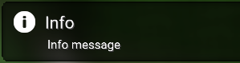
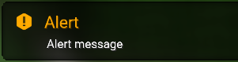
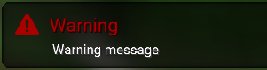

# **Notifications**

These display a small toast notification in bottom-right corner. 

!!! Note

    You should generally keep the notification message & title as short as you can.

``` java
Meowtils.notify(String title, String message, NotificationManager.Type type, long time)
```

## Types

Determines the type of notification, this only affects what icon is used and the color of the icon + title.

### Info

``` java
NotificationManager.Type.INFO
```



### Alert

``` java
NotificationManager.Type.ALERT
```



### Warning

``` java
NotificationManager.Type.WARNING
```



## Example

``` java
Meowtils.notify("Player Warning", "Player is invisible!", NotificationManager.Type.ALERT, 1500);
```