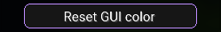

# **Component**

---

This component will display a button that can be clicked, when clicked specified code will run.



!!! tip "Recommended Usage"

    This should be used for when code needs to run once, such as opening a folder or displaying information.
    
---

``` java
button(String name, float textScale, Runnable action)

// Example
button("Example button", 5, () -> {
    // Run your code here
});
```

### Name

The name of the button.

### Text scale

The scale of the text that is displayed on the button, should be smaller if name is longer. 10 is equivalent to 1 for normal font.

### Action

The code that should run when the button is clicked.