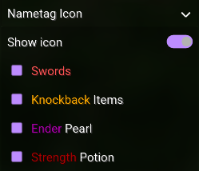

# **Expand Component**

---

This component can be expanded to display additional components registered under it.




!!! tip "Recommended Usage"

    This should be used when you need to compact how many settings you have.
    
---

``` java
expand(String name, Consumer<ExpandValue> builder)

// Example
expand("Items", e -> {
    e.toggle("Example item", "exampleItem");
});
```

### Name

The name of the expand component as shown.

### Builder

This will build a list of components that show up when expanding it.