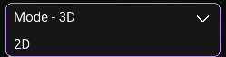

# **Mode Component**

---

**For:** `string values`

This component will display a dropdown where you can set specified modes.




!!! tip "Recommended Usage"

    This should be used for features where you might have different modes, such as 3D and 2D for ESP.
    
---

``` java
mode("Mode", Arrays.asList("Mode 1", "Mode 2", "Mode 3"), "exampleMode");
```

### Name

The name that is shown in front of the selected mode.

### Modes

Array of modes that can be selected.

### Config

The name of the `@Config` field.

!!! Example

    ``` java
    @Config public String exampleMode = "Mode 1";
    ```