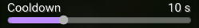

# **Sider Component**

---

**For:** `number values`

This component will display a slider for changing a number.



!!! tip "Recommended Usage"

    This should be used for any numbers that have a min & max cap.
    
---

``` java
slider(String name, double min, double max, double increment, @Nullable String valueType, String config, Class<?> targetType)

// Example
slider("Example delay", 0, 1000, 50, "ms", "delay", int.class);
```

### Name

The name of the setting.

### Minimum value

The minimum value a slider can be dragged to.

### Maximum value

The maximum value a slider can be dragged to.

### Increment

The amount it is incremented by while dragging.

!!! Example
    
    While dragging the value would jump by 50 at a time:
    `0 → 50 → 100 → 150`

### Value type

This is just text after the current number that displays what value you're changing.

Set it to `null` for no value type to be displayed.

### Config

The name of the `@Config` field.

!!! Example

    ``` java
    @Config public int delay = 100;
    ```

### Target type

!!! Tip

    For simplicity, you can stick to using `int` for whole numbers, and `float` for decimals in most cases.

The number type you are modifying, which is what your `@Config` is set to.

``` txt title="Types"
byte.class
short.class
int.class
long.class
float.class
double.class
```