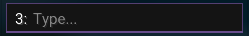

# **Text Component**

---

**For:** `string values`

This component will display a text box where you can type text.



!!! tip "Recommended Usage"

    This should be used for anything where you can manually edit text.
    
---

``` java
text(@Nullable String name, String config)
text(@Nullable String name, String description, String config)

// Example
text("Example text", "exampleText");
text("Example text", "Example desc", "exampleText");
```

### Name

Name of the text box, can be set to `null` if you don't want a name to be displayed.

### Description

You can add a description, if added it will display it in gray text when nothing is currently set.

### Config

The name of the `@Config` field.

!!! Example

    ``` java
    @Config public String exampleText = "Meow";
    ```