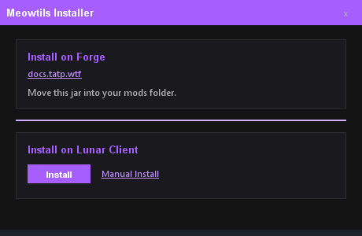
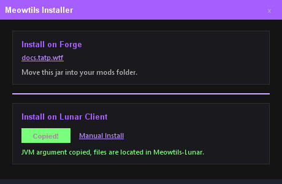
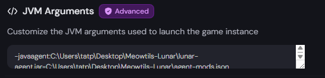

# **Installation**

!!! Info

    **Meowtils** is a one-time installation, after following these steps it will always inject into your game at startup. 

Any future updates will be handled by the [Auto-Updater](../other/auto-updates.md), which means you won't have to manually replace any files or install it again.

_The **Auto-Updater** can still be disabled if you want to update manually._

---

## **Forge**

### 1: Install Forge

**If you already have Forge installed you can skip this step.**

!!! Warning

    You can use third-party launchers for **Forge**, such as [Prism Launcher](https://prismlauncher.org/) or [Feather Client](https://feathermc.com/), however these will have different installation steps.

    **Certain launchers may not be supported.**

1. Download [Forge Installer](https://maven.minecraftforge.net/net/minecraftforge/forge/1.8.9-11.15.1.2318-1.8.9/forge-1.8.9-11.15.1.2318-1.8.9-installer.jar).

2. Execute the installer by clicking/opening it.

3. In the window, select **Install client**, then click **OK**.

4. After installation is complete, open your Minecraft Launcher and select **Forge** in your versions dropdown menu (where you select which Minecraft version to use). This menu is found when making/editing installations.   
**Full name:** `release 1.8.9-forge1.8.9-11.15.1.2318-1.8.9`

5. Launch your game once to create the necessary files, or manually navigate to your instance folder (by default, .minecraft), then create a folder called `mods`.

!!! Note

    If you are unable to run the .jar, you will need to install [Java](https://www.java.com/en/download/).

### 2: Add Meowtils

1. [Download Meowtils](https://tatp.wtf/download/).

2. Add the **Meowtils** jar to your `mods` folder.

### 3: Launch Minecraft

Now launch Minecraft, **Meowtils** should be loaded.

It is recommended that you check out [Basic Usage](../basic-usage) in order to learn how to use **Meowtils**.

---

## **Lunar Client**

### 1: Install Lunar Client

1. [Download Lunar Client](https://www.lunarclient.com/download).

2. Follow their installation steps.

### 2: Download Meowtils

[Meowtils](https://tatp.wtf/download/).

### 3: Follow Meowtils installation steps

1. Execute the **Meowtils** jar by clicking/opening it.

2. Click `Install` in the **Install on Lunar Client** section.

    

3. Wait for installation to complete, there should now be a **JVM Argument** copied to your clipboard.

    

!!! Note

    If you are unable to run the .jar, you will need to install [Java](https://www.java.com/en/download/).

### 4: Add Meowtils to Lunar

1. Open settings in **Lunar Launcher** (bottom left corner).

2. Enable advanced mode, next to the search bar;

    

3. Navigate to the **Game Settings** section, scroll down until you find the **JVM Arguments** box.

4. Paste the **JVM Arguments** that were copied from previous step into this box.

5. If visible, click the save icon;

    

### 5: Confirm it is installed correctly

There should be a folder called **Meowtils-Lunar** created in the same directory as the jar you used for installation. This contains all necessary files.

You should also have your **JVM Arguments** in settings;



### 6: Launch Minecraft

Now launch Minecraft, **Meowtils** should be loaded.

It is recommended that you check out [Basic Usage](../basic-usage) in order to learn how to use **Meowtils**.

!!! Note

    If installation didn't work for you, follow the manual installation guide below.

### Manual Installation

!!! Warning

    These steps require you to edit multiple things that you may not be familiar with, and if anything is done incorrectly it will fail. It is recommended that you use the **Meowtils Installer** shown above which automates all of this for you, if possible.

### Uninstall.

In order to un-install, you may need to delete the bake cache zip located somewhere in your lunar files. This can usually be found by navigating to the `.lunarclient` folder.

---

### 1: Download Meowtils

[Meowtils-Lunar.zip](https://github.com/femboytatp/meowtils/releases/latest/download/Meowtils-Lunar.zip).

### 2: Extract the downloaded archive

Your operating system likely has a tool to extract .zip files already, if not you will have to download one.

[7-Zip](https://www.7-zip.org/)

### 3: Open **agent-mods.json**

Edit the file path so it points towards the **Meowtils** jar.

!!! Example

    ``` json
    {
      "mods": [
        {
          "jar": "C:\\Users\\tatp\\Desktop\\Meowtils-Lunar\\Meowtils.jar",
          "mixin": "mixins.meowtils.json",
          "property": "meowtils.agent.injected"
        }
      ]
    }
    ```

!!! Info

    The path will look different depending on operating system, but on Windows it uses `\`, in this case you need to insert an extra `\` as an escape character. This is shown in the example above.

### 4: Construct the **JVM Argument**

The **JVM Argument** points to the agent jar, and the agent json.

Agent jar: `-javaagent:C:\Users\tatp\Desktop\Meowtils-Lunar\lunar-agent.jar`

Agent json: `=C:\Users\tatp\Desktop\Meowtils-Lunar\agent-mods.json`

Insert the correct path to each file, and then combine them.

!!! Example

    ``` txt title="Combined Arguments"
    -javaagent:C:\Users\tatp\Desktop\Meowtils-Lunar\lunar-agent.jar=C:\Users\tatp\Desktop\Meowtils-Lunar\agent-mods.json
    ```

### 5: Add Meowtils to Lunar

1. Open settings in **Lunar Launcher** (bottom left corner).

2. Enable advanced mode, next to the search bar;

    

3. Navigate to the **Game Settings** section, scroll down until you find the **JVM Arguments** box.

4. Paste the **JVM Arguments** that you constructed from previous step.

5. If visible, click the save icon;

    

### 6: Launch Minecraft

Now launch Minecraft, **Meowtils** should be loaded.

It is recommended that you check out [Basic Usage](../basic-usage) in order to learn how to use **Meowtils**.