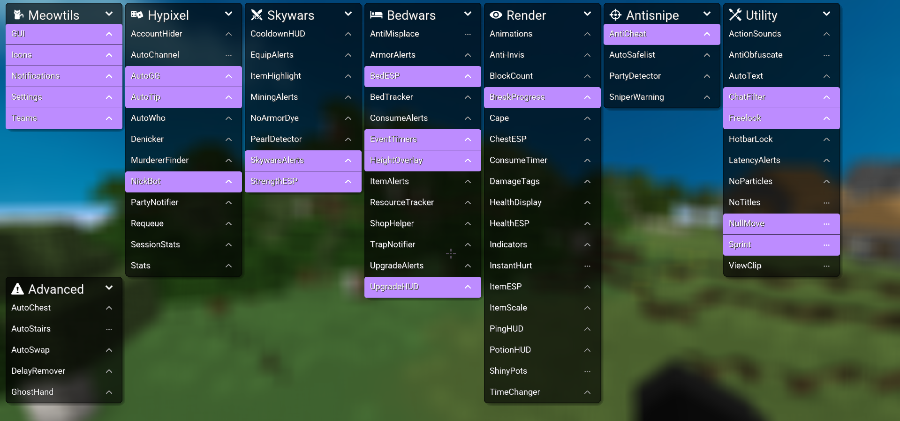

# **What is Meowtils?**

**Meowtils** is a Minecraft utility mod with features that are focused towards specific servers and gamemodes, as well as general quality of life enhancements that can be useful anywhere.

## Information

   

!!! Warning "Caution"

    The only official places to download **Meowtils**:   

    - The official **Meowtils** website: [meowtils.dev](https://meowtils.dev/)   

    - The repository: [github.com/femboytatp/meowtils](https://github.com/femboytatp/meowtils)   

    - My projects website: [tatp.wtf](https://tatp.wtf/)

## Supported Versions

- [x] **Forge 1.8.9**

- [x] **Lunar Client 1.8.9**

[**Installation Guide**](guides/installation.md)

## Supported Platforms

- [x] **Windows**

- [x] **Linux**

- [x] **Mac**

**Lunar Injection is supported on all platforms.**

_In rare cases certain features may only work on Windows, if so that will be disclosed on their respective docs page._

## Features

- **70+ Modules**  
    For various gamemodes, servers, and just general QOL features.

- **Ingame Stats**  
    Like Hypixel stat overlays, but ingame.

- **Clientside Anticheat**  
    Detects if players around you use certain cheats.

- **Personal Blacklist**  
    Allows you to add players for any reason to your own blacklist, which will then alert you if you meet them ingame.

- **Commands**  
    A lot of commands for various things, such as quickly joining a game, checking player stats, or shortcuts for longer commands.

- **Extensions**  
    Like a small mod loaded by **Meowtils**, which lets you add your own features. Could be viewed as a powerful scripting API.
